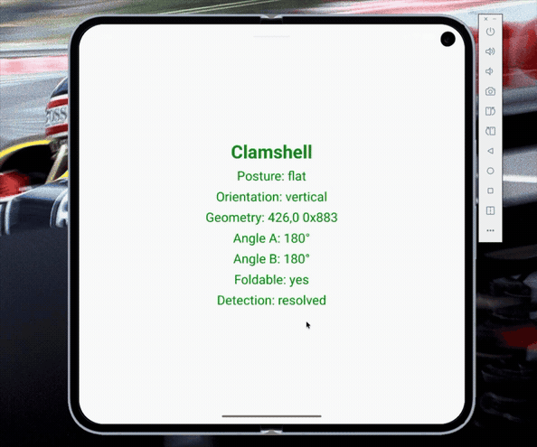

# react-native-clamshell

<p align="center">
  
</p>

Foldable-device posture, fold geometry, and hinge-angle delivery for React
Native New Architecture apps.

`react-native-clamshell` exposes low-frequency fold state through Nitro
methods/listeners and continuous hinge angle updates through a native Worklets
UI-runtime bridge. Angle animation does not depend on a JavaScript listener or
JS-thread scheduling fallback.

[](https://www.npmjs.com/package/react-native-clamshell)
[](https://www.npmjs.com/package/react-native-clamshell)
[](https://github.com/stefanilie/react-native-clamshell/blob/main/LICENSE)

## Installation

```sh
yarn add react-native-clamshell react-native-nitro-modules \
  react-native-reanimated react-native-worklets
```

Configure the Worklets Babel plugin last:

```js
module.exports = {
  plugins: ['react-native-worklets/plugin'],
}
```

Then install native dependencies and rebuild the app:

```sh
bundle exec pod install
yarn android # or your app's Android build
yarn ios     # or your app's iOS build
```

## Usage

```tsx
import { useHingeAngle } from 'react-native-clamshell'
import Animated, { useAnimatedStyle } from 'react-native-reanimated'

export function FoldIndicator() {
  const hingeAngle = useHingeAngle()

  const style = useAnimatedStyle(() => ({
    opacity: hingeAngle.value == null ? 0.35 : 1,
    transform: [{ rotate: `${hingeAngle.value ?? 0}deg` }],
  }))

  return <Animated.View style={style} />
}
```

`useHingeAngle()` returns a Reanimated shared value updated directly on the UI
runtime. See the [API guide](docs/api.md) for hooks, imperative subscriptions,
capability readiness, lifecycle behavior, errors, and exported types.

## Foldable capability matrix

Capabilities vary by model, firmware, region, and operating-system release.
See the [detailed capability matrix](docs/api.md#foldable-capability-matrix) for
evidence and limits.

Legend: `✅ confirmed working`, `⚠️ partial, device-dependent, or unverified`,
`❌ unavailable`.

| Brand and models                           | Public angle          | Posture               | Geometry              | Limits                  |
| ------------------------------------------ | --------------------- | --------------------- | --------------------- | ----------------------- |
| HONOR: Magic V foldable family             | ⚠️ Runtime probe      | ✅ Vendor documented  | ✅ Sidecar documented | ⚠️ No hardware          |
| Samsung: Galaxy Z Fold and Z Flip families | ⚠️ Firmware dependent | ✅ Vendor documented  | ✅ Vendor documented  | ⚠️ Angle varies         |
| Google: Pixel Fold family                  | ✅ Public sensor      | ✅ Platform contract  | ✅ Platform contract  | ⚠️ Later inferred       |
| Motorola: Razr foldable family             | ⚠️ Firmware dependent | ✅ Source confirmed   | ✅ Platform contract  | ⚠️ Generations inferred |
| iPhone Duo                                 | ✅ Simulator verified | ✅ Simulator verified | ❌ Unavailable        | ⚠️ Hardware unverified  |

## Verification labels

| Signal                 | Android                                                                                                                    | iOS                                                                                |
| ---------------------- | -------------------------------------------------------------------------------------------------------------------------- | ---------------------------------------------------------------------------------- |
| Native build/test      | Verified locally and in release gate commands                                                                              | Verified on iOS 27.1 Simulator: 28 tests passed, with 1 older-OS-only test skipped |
| Fold posture           | Hardware-verified on a Samsung foldable; emulator-verified on Pixel 10 Pro Fold AVD                                        | iPhone Duo simulator-verified for `closed`, `halfOpen`, and `fullyOpen`            |
| Fold geometry          | Hardware-verified as RN-root-relative DIP on a Samsung foldable                                                            | Unavailable; capabilities report `false` and snapshots report `null`               |
| Continuous angle       | Emulator-verified; tested Samsung hardware emitted only 0/90/180 degree samples                                            | iPhone Duo simulator-verified with exact values throughout the hinge sweep         |
| UI-runtime delivery    | Harness-verified on Android and iOS simulator                                                                              | iPhone Duo simulator-verified; the Worklets indicator tracks live hinge samples    |
| Real foldable hardware | Posture/geometry verified on a Samsung foldable; continuous angle unavailable through its public sensor on tested firmware | Unverified                                                                         |

Verification command output and device details are maintained outside the
public package history.

## Credits

Bootstrapped with
[create-nitro-module](https://github.com/patrickkabwe/create-nitro-module).
